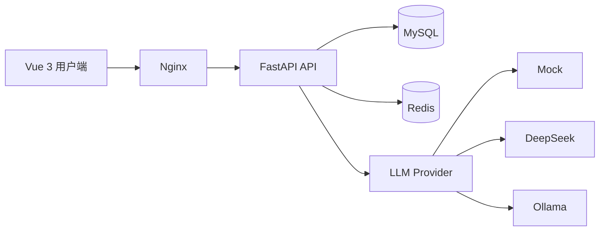

# PrepPilot · AI 模拟面试

PrepPilot 是一个基于简历上下文的 AI 模拟面试平台。用户上传 PDF 简历、选择目标岗位和难度后，系统会检索相关项目经历生成个性化问题，对回答进行评分和追问，并保存完整面试记录与复盘报告。

当前版本优先保证核心业务可以完整跑通。默认使用本地 Mock 模型，不需要 API Key；需要更真实的出题与评分时，可以切换到 DeepSeek 或本机 Ollama。

## 已实现功能

- Vue 3 用户端：注册登录、训练控制台、简历上传、逐题面试、报告和个人设置。
- FastAPI 异步后端：清晰的 Router → Schema → Service → Model 分层。
- JWT access token + refresh token，支持刷新、退出和密码修改后的令牌撤销。
- Redis 登录验证码、有效期和发送冷却；开发环境可自动填入验证码。
- PDF 文件校验、文本提取、本地保存、用户权限隔离和简历删除。
- 简历文本自动切片、关键词检索、上下文拼接和来源片段记录。
- Mock、DeepSeek/OpenAI-compatible、Ollama 三种 LLM Provider。
- 面试难度与题量配置、重复答题保护、即时评分、追问、进度和综合报告。
- MySQL 持久化、Alembic 自动迁移、pytest 接口测试和 Docker Compose 一键启动。

## 系统结构



核心面试链路如下：

```text
PDF 上传 → 文本提取 → 自动切片 → 关键词检索
→ Prompt 拼接 → 生成问题 → 提交回答
→ 评分与追问 → 数据库存档 → 综合报告
```

## Docker 一键启动

需要提前安装 Docker Desktop 或 Docker Engine + Compose。

```bash
git clone https://github.com/ztandcos/ai-interview.git
cd ai-interview
cp .env.docker.example .env
docker compose up -d --build
```

服务启动后访问：

- 用户端：[http://localhost:8080](http://localhost:8080)
- 后端接口文档：[http://localhost:8006/docs](http://localhost:8006/docs)
- 后端健康检查：[http://localhost:8006/api/v1/health](http://localhost:8006/api/v1/health)

默认端口为前端 `8080`、后端 `8006`、MySQL `3307`、Redis `6380`。如果端口被占用，可以在 `.env` 中修改对应的 `*_EXPOSE_PORT`。

第一次启动会自动完成数据库迁移。默认 `LLM_PROVIDER=mock`，注册后在登录页点击“获取验证码”，开发验证码会自动填入。

常用命令：

```bash
make up       # 构建并启动
make status   # 查看容器状态
make logs     # 跟踪日志
make down     # 停止服务，保留数据
make reset    # 停止服务并删除本项目 Docker 数据卷
```

## 切换真实模型

### DeepSeek

修改 `.env`：

```dotenv
DOCKER_LLM_PROVIDER=deepseek
DOCKER_LLM_MODEL_NAME=deepseek-chat
DOCKER_LLM_API_KEY=你的_API_Key
DOCKER_LLM_BASE_URL=https://api.deepseek.com
DOCKER_LLM_FALLBACK_TO_MOCK=true
```

然后重建后端：

```bash
docker compose up -d --build backend
```

### 本机 Ollama

先确保宿主机已经启动 Ollama，再修改 `.env`：

```dotenv
DOCKER_LLM_PROVIDER=ollama
DOCKER_OLLAMA_BASE_URL=http://host.docker.internal:11434
DOCKER_OLLAMA_MODEL_NAME=qwen2.5:3b
DOCKER_LLM_FALLBACK_TO_MOCK=true
```

`DOCKER_LLM_FALLBACK_TO_MOCK=true` 表示真实模型暂时不可用时仍能继续跑通业务。Docker 使用独立的 `DOCKER_LLM_*` 变量，避免覆盖本地开发的模型配置。

## 本地开发

### 后端

本地开发需要可访问的 MySQL 和 Redis。先复制配置并按本机环境修改：

```bash
cp .env.example .env
python3.11 -m venv .venv
.venv/bin/pip install -r requirements.txt
.venv/bin/alembic upgrade head
.venv/bin/uvicorn app.main:app --reload
```

后端默认运行在 [http://localhost:8000](http://localhost:8000)。

### 前端

```bash
cd frontend
npm install
npm run dev
```

前端开发服务器运行在 [http://localhost:5173](http://localhost:5173)，并将 `/api` 代理到本机 `8000` 端口。

## 测试与构建

```bash
make test
make frontend-build
```

后端测试使用临时 SQLite 数据库、Fake Redis 和 Mock LLM，不依赖正在运行的 MySQL、Redis 或外部模型，因此适合本地开发和 CI。当前接口测试覆盖：

- 注册、验证码、登录、刷新令牌、退出和密码修改。
- JWT 保护接口与个人资料更新。
- PDF 上传、自动切片、检索和用户数据隔离。
- 生成问题、回答评分、追问、重复答题保护和完成条件。
- 面试记录、报告、简历与面试删除。

## 主要 API

| 模块 | 接口 |
| --- | --- |
| 认证 | `/api/v1/auth/register`、`login`、`refresh`、`logout`、`me` |
| 验证码 | `/api/v1/verification/send`、`verify` |
| 简历 | `/api/v1/resumes`、`/{id}/chunks`、`/{id}/search` |
| 独立 AI 能力 | `/api/v1/resumes/{id}/interview/questions`、`score`、`follow-up` |
| 面试会话 | `/api/v1/interviews`、`/{id}`、`/{id}/answers`、`/{id}/complete` |

完整请求与响应格式以 FastAPI 的 `/docs` 为准。

## 目录结构

```text
.
├── app/                  # FastAPI 应用
│   ├── api/              # 路由与依赖
│   ├── core/             # 配置、安全和 Redis
│   ├── db/               # SQLAlchemy session
│   ├── models/           # 数据库模型
│   ├── prompts/          # Prompt 模板
│   ├── schemas/          # Pydantic 请求/响应
│   └── services/         # 业务与 AI Provider
├── frontend/             # Vue 3 + Vite 用户端
├── migrations/           # Alembic 迁移
├── tests/                # 自动化测试
├── Dockerfile            # 后端镜像
└── docker-compose.yml    # MySQL、Redis、后端和前端
```

## 当前边界与下一步

这是“先跑通完整用户闭环”的版本。为了让代码仍然适合学习，当前 RAG 使用固定长度切片和关键词召回，还没有加入 embedding 与向量数据库；验证码默认是开发模式，没有接真实邮件；也暂未加入管理后台、SSE、Celery 和云存储。

推荐下一阶段按效果优先级迭代：先升级混合/向量检索并建立召回评估，再接真实邮件和生产安全配置，最后根据展示需求增加 SSE 或管理后台。
